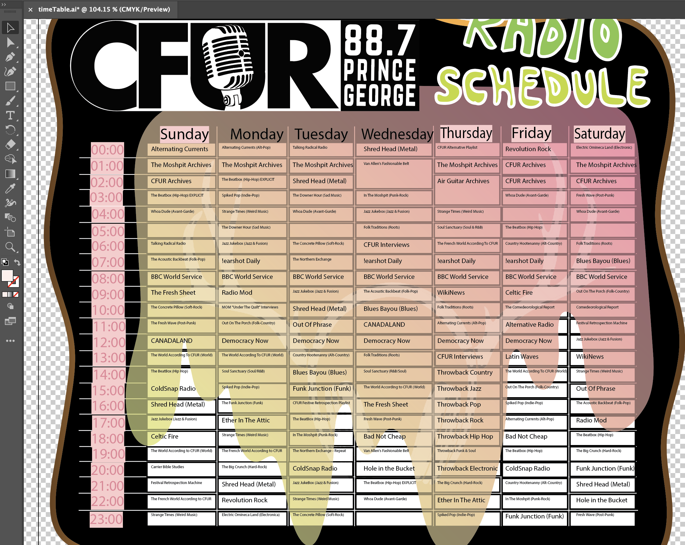

# Google Calendar to Adobe Illustrator Schedule Parser
This program takes in a google calendar (ics) file, parses the file and prints the output into the CFUR playlist schedule in adobe illustrator.

## Classes
### Event
This class is used to encapsulate parsed events.
### Parser
This class handles parsing incoming text files and printing the parsed data to an output file.
#### &nbsp;&nbsp;&nbsp;&nbsp;Functions
- parseFile
    * This function handles parsing data from an incoming text file in multiple steps.
    1. Lines from the text file are read and stored in the lines variable.
    2. The lines variable is then used in a for loop to scan for specific event attribute identifiers.
    3. Once an identifier is found the data from that line will cleaned and saved into a temporary varible for future use.
    4. At the end of an event block the temporary variables are used to create an Event object that is then push to a list of Events.
- getRruleDay
    * This function is used in the parseFile function and determines what day an event will regularly reoccur on then returns that day in the form of a string.
- cleanList
    * This function is used to create a new 'clean' event list that excludes past events that have been saved to the event list that's used to hold all events saved from the parseFile function.
- getDate
    * This function uses the current days datetime to get the date of the most recent sunday in the current week.
- printEvents
    * This Function will create a new file and print Events from the earleir mentioned Event list to said file.

## Example 
### Creating a parse file for adobe illustrator
```console
my@comp: python icsParser.py <fileToBeParsed>.txt
```
- Example of output parse file
```console
-----EVENT 1
CFUR Alternative Playlist
0
20140625
BYDAY=MO
-----EVENT 2
CFUR Festive Retrospection Playlist
16
20160312
BYDAY=MO
-----EVENT 3
CFUR Dance Playlist
2
20160507
BYDAY=MO
```
### Generating schedule from parse file
*   In illustrator goto the 'file' tab, select 'scripts' then 'other scritps' and select the adobe.jsx file. This will run the script and generate a version of the schedule below.



## Notes
- The file to be parsed must be in the same directory as this python file.
- More detail on the functions can be find in the comments.

## Future Fixes
- Text alignment in cells
- Varying text size depending on length of the string
- Increasing text range stroke width to increase visability

